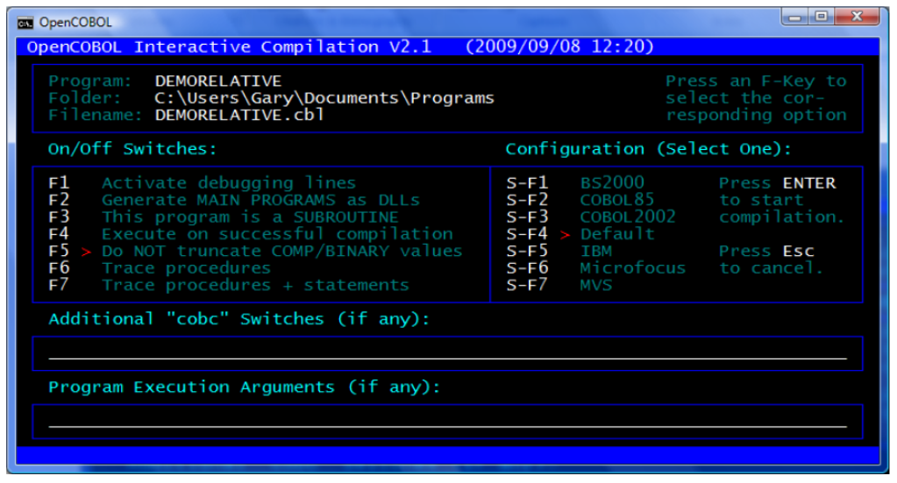

### 1.2.8. テキストユーザインターフェース(TUI)機能

COBOL2002 標準は、テキストベースの画面の定義と処理を可能にする COBOL 言語の拡張機能を形式化している。opensource COBOL は、COBOL2002 で説明されている画面処理機能を実質的にすべて実装している。

以下は、Windowsコンピュータのコンソールウィンドウに表示される画面の例である。

図 1-1-TUIサンプル画面

](Image/1-1.png)

このような画面`2`は、データ部(5.6) の画面節で定義され、一度定義されると、画面は ACCEPT文 (6.4.4) および DISPLAY文 (6.14.4)を介して実行時に再度使用される。

COBOL2002 標準は、テキストユーザインターフェース(TUI)画面のみを対象としており、最新のオペレーティングシステムに組み込まれている、より高度なグラフィカルユーザインターフェース(GUI)画面設計および処理機能は対象ではない。完全な GUI 開発ができるサブルーチンベースのパッケージが利用可能ではあるが、どれもオープンソースではない。

---

`2` この画面は、OCicという名前のプログラム―opensource COBOLコンパイラのフルスクリーンフロントエンド―のものである。