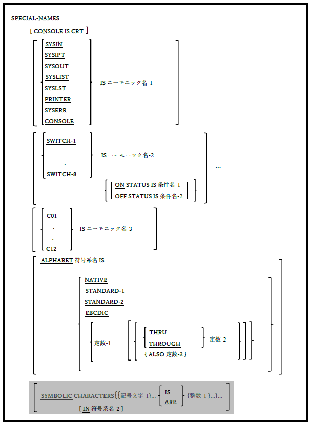
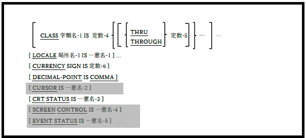
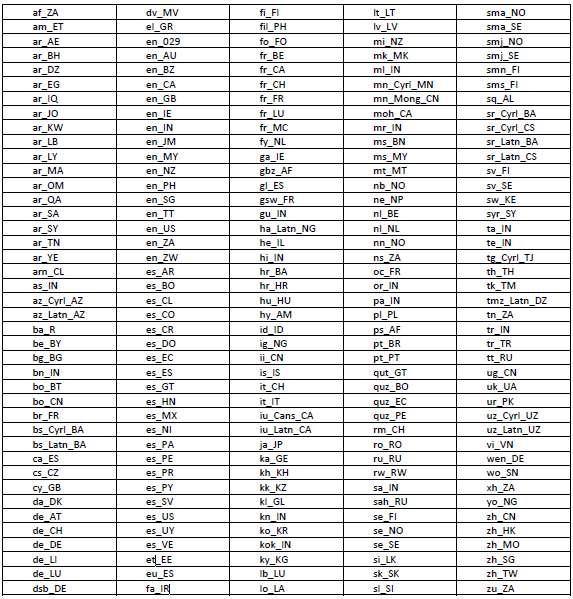

### 4.1.4. 特殊名段落

図4-6-特殊名段落構文

特殊名(SPECIAL-NAMES)段落は、通貨記号の指定、小数点の選択、[記号文字の指定]実装者名とユーザ指定のニーモニック名の関連付け、アルファベット名と文字セットまたは大小順序の関連付け、および字類名と文字のセットの関連付けを行う。

つまり、この段落には、別のPC環境で作成されたCOBOLプログラムを簡単に「構成」して、opensource COBOL環境では最小限の変更のみでコンパイルできるようにするといった役割がある。

1. CONSOLE IS CRT句は、opensource COBOLの他のバージョンとのソースコードの互換性を保持する。これにより、デバイス「CRT」と「CONSOLE」をDISPLAY文(6.14.1)およびACCEPT文(6.4.1)で相互に使用できるようになる。opensource COBOLプログラムを「ゼロから」コーディングする場合は、これら二つのデバイスはすでに同様のものと見なされているため、この句は必要ない。

2. IS ニーモニック名-1句を使うと、「IS」の前に指定された組み込みopensource COBOLデバイス名に代替名を定義することができる。

3. SWITCH-1からSWITCH-8の外部値は、それぞれCOB_SWITCH_1からCOB_SWITCH_8の環境変数を使用してプログラムに指定される。「ON」の値はスイッチをオンにし、その他の値(未定義の環境変数を含む)はスイッチをオフにする。ON STATUS句およびOFF STATUS句は、実行時にスイッチが設定されているかどうかをテストするための条件名を定義する。詳細については6.1.4.2.1および6.1.4.2.4で説明する。

4. ALPHABET句は、「定数-1」オプションを使用して自分で定義したものを含め、名前を、指定された文字コードセットまたは大小順序と関連付けることができ、定数-1、定数-2、または定数-3に英数字定数を指定できる。比喩的な定数SPACE [S]、ZERO [[E] S]、QUOTE [S]、HIGH-VALUE [S]、またはLOW-VALUE [S]を指定することもできる。

5. SYMBOLIC CHARACTERS句は構文的に認識されても無視される。「-Wall」または「-W」コンパイラスイッチを使用すると、この機能がまだ実装されていないことを示す警告メッセージが表示される。

6. ユーザ定義クラスは、CLASS句を使って定義される。この句で指定された定数はクラスの一部と見なされるため、データ項目の値に含まれる可能性のある文字を定義する。例えば、以下に「Hexadecimal」と呼ばれるクラスを定義し、データ項目が「Hexadecimal」クラスの一部である場合、データ項目に存在する可能性のある文字のみを指定する。

        CLASS Hexadecimal IS ‘0’ THRU ‘9’, ‘A’ THRU ‘F’, ‘a’ THRU ‘f’

    このユーザ定義クラスの使用例については、6.1.4.2.2で説明する。

   LOCALE句を使って、UNIX標準のローカル名をデータ部で定義された一意名と関連付けることができ、局所名は次のいずれかになる：

  表4-7-局所名

  

7. CURRENCY SIGN句を使って、PICTURE編集記号で使用される通貨記号として任意の1文字を定義できる(表5-9を参照)。通貨記号が指定されていない場合の既定値はドル記号($)である。

8. DECIMAL POINT IS COMMA句は、PICTURE編集記号(表5-9を参照)および数字定数として使用される場合「,」および「.」文字の定義を逆にするが、望ましくない副作用が生じる可能性がある(1.6を参照)。

9. 一意名-3のPICTURE句(CRT-STATUS)は9(4)である必要がある。この項目はACCEPT画面の実行時ステータスを示す4桁の値を受け取り、ステータスコードは次の通りである。

    表4-8-ACCEPT画面ステータスコード

    | コード | 意味  |
      | :--- | :--- |
      | 0000 | ENTERキー押下|
      |1001 - 1064|F1 — F64|
      |2001,2002|PgUP,PgDn4|
      |2003,2004,2006|上矢印,下矢印,PrtSc(プリントスクリーン)5|
      |2005|Esc6|
      |8000|ACCEPT画面に利用できるデータがない|
      |9000|致命的なI/O画面エラー|

10. CRT STATUS句が指定されていない場合、ACCEPTステータス画面を受け取る目的で、COB-CRT-STATUS一意名(9(4)のPICTURE句)が暗黙的に割り当てられる。

11. SCREEN CONTROL句とEVENT STATUS句は、コンパイル時にサポートされていない一方で、CURSORIS句はサポートされている。しかし現在、実行時には機能していない。

---

`4` 実行時に環境変数COB_SCREEN_EXCEPTIONSが空白以外の値に設定されている場合にのみ使用できる。

`5` Windowsシステムでは検出できない。

`6` 実行時に環境変数COB_SCREEN_ESCが空白以外の値に設定されている場合にのみ使用できる。(これはCOB_SCREEN_EXCEPTIONSの設定に追加される)。
