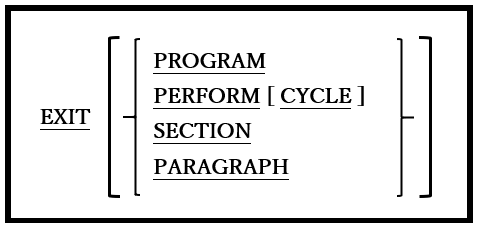
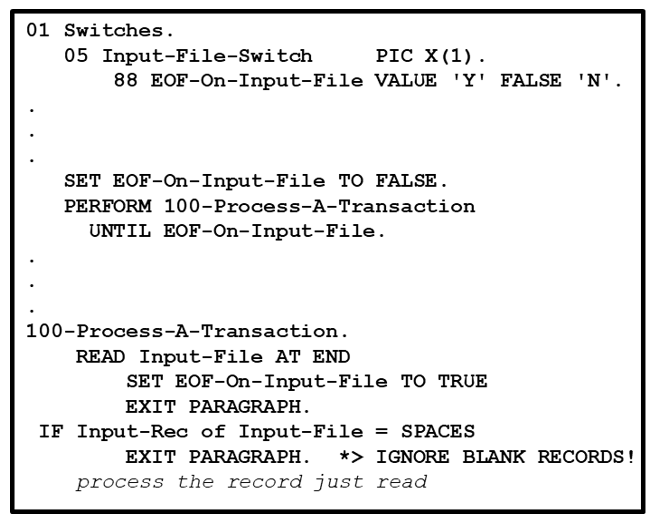
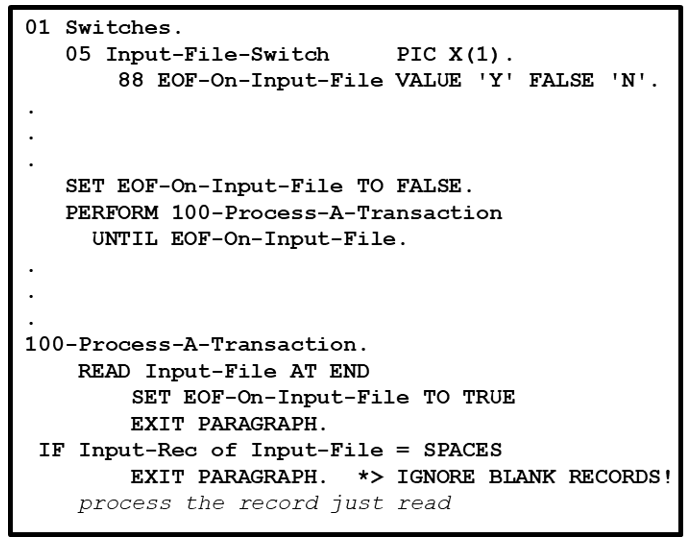
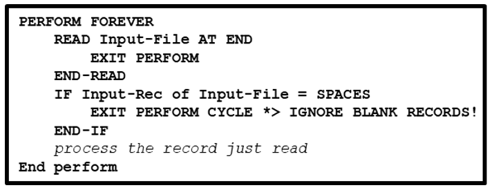

## 6.18. EXIT

図6-55-EXIT構文

EXIT文は多様な目的に使用できる文である。一連のプロシージャに共通のエンドポイントを提供したり、インラインPERFORM、段落、または節を終了したり、呼び出されたプログラムの論理的な終了を示す。

1. 「EXIT」文をオプションの句を指定せずに使用すると、一連のプロシージャに共通の「GO TO」エンドポイントを提供する。

    図6-56-EXIT文
    

2. EXIT文を使う場合、それを扱う段落内で唯一の文である必要がある。

3. EXIT文は操作不要である(CONTINUE文とよく似ている)。

4. EXIT PARAGRAPH文は、現在の段落の終わりを過ぎた時点に制御を移すが、EXIT SECTION文は、現在の節の最後の段落を過ぎた時点に制御を移す。

    EXIT PARAGRAPHまたはEXIT SECTIONが手続き型PERFORM(6.32.1)の範囲内の段落にある場合、制御はPERFORMに戻され、TIMES、VARYING、および/またはUNTIL句での評価が行われる。EXIT PARAGRAPHまたはEXIST SECTIONが手続き型PERFORMの範囲外にある場合、制御は次の段落(EXIT PARAGRAPH)または節(EXIT SECTION)の最初の実行可能な文に移る。図6-55は、EXIT PARAGRAPH文を使って、GO TOなしで図6-54の例をコーディングする方法を示している。

    図6-57-EXIT PARAGRAPH文
    

5. EXIT PERFORMおよびEXIT PERFORM CYCLE文は、インラインPERFORM文(6.32.2)と組み合わせて使うことを目的としている。

6. EXIT PERFORM CYCLEは、インラインPERFORMの現在の繰り返しを終了し、別のサイクルを実行する必要があるかどうかを判断するために、TIMES、VARYING、および/またはUNTIL句を制御する。

7. EXIT PERFORMは、インラインPERFORMを完全に終了し、PERFORMに続く最初の文に制御を移す。図6-58は、図6-56の例に対する最終変更を示していて、インラインPERFORM文とEXIT PERFORM文を使うことによって処理を確実に簡素化できる。

    図6-58-EXIT PERFORM文
    

8. 最後に、EXIT PROGRAM文は、サブルーチン(つまり、別のプログラムによってCALLされているプログラム)の実行を終了し、CALLに続く文のCALLする側のプログラムに戻る。メインプログラムによって実行された場合は、EXIT PROGRAM文は機能しない。COBOL2002標準は、COBOL言語に共通の拡張を行った。それがGOBACK文(6.21)であり、EXIT PROGRAMの代わりとして検討すべきである。
