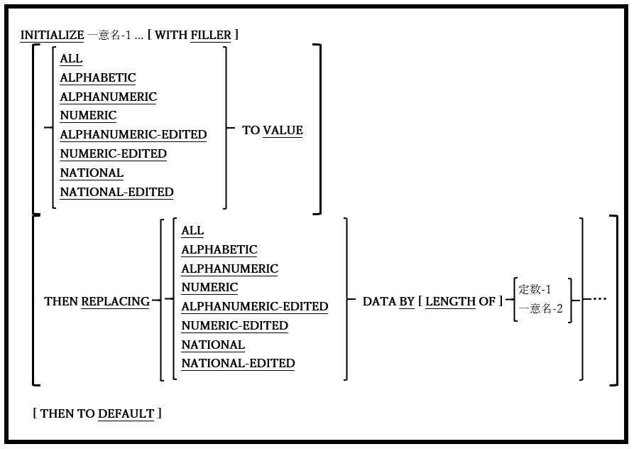

## 6.24 INITIALIZE

図6-66-INITIALIZE構文

INITIALIZE文は、一意名-1として指定された基本項目、または一意名-1として指定された集団項目に従属する基本項目を特定の値に設定する。

1. これによって新しい値に設定できるデータ項目のリストは次の通りである。

    - 一意名-1として指定されたすべての基本項目。

    - 一意名-1として指定され、集団項目に<u>従属して</u>定義されたすべての基本項目。以下の例外を除く：

        - USAGE INDEX項目は除外される。

        - 定義の一部としてREDEFINES句が含まれる項目は除外され、これに従属する項目も除外される。ただし、一意名-1の項目自体にREDEFINES句が含まれている場合や、REDEFINES句を含む項目に従属している場合がある。

    以上は受け取り項目のリストである。

2. 一意名-1項目の定義内、また、一意名-1項目に従属する項目にOCCUR DEPENDING ON句(5.3参照)を含めることはできない。

3. オプションとしてWITH FILLER句が存在する場合、FILLER項目は受け取り項目のリストに入る(そうでない場合は除外となる)。

4. TO VALUE句またはREPLACING句が指定されていない場合、DEFAULT句が指定されたとみなす。

5. オプションとしてREPLACING句が指定されている場合、INITIALIZE文が構文的にコンパイラに受け入れられるためには、送信項目のMOVE文が、すべての受け取り項目に対して有効でなければならない。

6. 各受け取り項目の初期化は、以下のルールに従って行われる。

    - TO VALUE句が存在する場合、その受け取り項目はTO VALUE句にリストされているデータカテゴリに含まれているか。含まれている場合、データ項目はそのVALUE句の値に初期化される。

    - REPLACING句が存在する場合、その受け取り項目はREPLACING句にリストされているデータカテゴリに含まれているか。含まれている場合、受け取り項目は指定された送信項目の値に初期化される。

    - DEFAULT句が存在する場合は、項目値をそのUSAGEに適当な値に初期化する(英数字と数値は空白、ポインタとプログラムポインタはNULL、すべての数値と数値編集はゼロに初期化される)。
