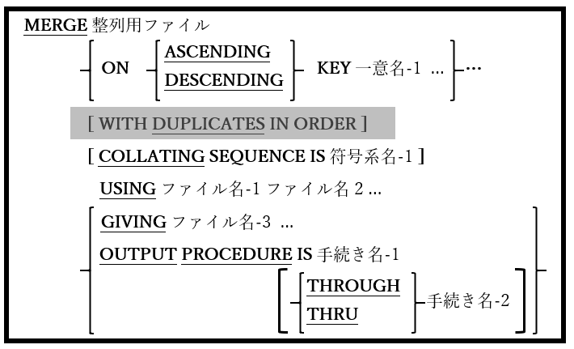

## 6.27. MERGE

図6-70-MERGE構文

MERGE文は、指定されたキーのセットで二つ以上の同じ順序ファイルを結合する。

1. MERGE文で指定された整列ファイルは、データ部のファイル節でソート記述(SD)を使って定義する必要がある。5.2では説明の残りの部分で、このファイルを「マージファイル」と呼んでいる。

2. ファイル名-1、ファイル名-2、およびファイル名-3(指定されている場合)は、ORGANIZATION LINE SEQUENTIALまたはORGANIZATION RECORD BINARY SEQUENTIALファイルを参照する必要がある。これらのファイルは、データ部のファイル節でファイル記述(FD)を使って定義しなければならない。5.1ではファイル名-1とファイル名-2で同じファイルが使われている。

3. 一意名-1･･･の項目は、整列ファイルのレコード内の項目として定義する必要がある。

4. WITH DUPLICATES IN ORDER句は互換性のためにサポートされているが機能していない。

5. ファイル名-1、ファイル名-2、ファイル名-3(存在する場合)、および整列ファイルのレコード記述は、レイアウトとサイズが同じであると見なされる。ファイルレコードの項目に使われる実際のデータ名は異なる場合があるが、レコードの構造、項目のPICTURE句、項目のサイズ、およびデータのUSAGE句は、すべてのファイルで項目ごとに一致する必要がある。

    MERGE文を使った一般的なプログラミング手法は、MERGEに関連するすべてのファイルのレコードを、「**01** レコード名 **PIC X(**n **).**」(nはレコードサイズを表す)という書き方の簡潔な基本項目として定義することである。レコードの詳細が実際に記述されている唯一のファイルが整列ファイルである。

6. USING句で指定されたファイルには、以下のルールが適用される。

    a. MERGEの実行時は、いずれのファイルもOPENになっていない場合がある。

    b. 各ファイルは、MERGE文のKEY句での指定によって既に並び替えられているとみなされる。

    c. SAME RECORD AREA、SAME SORT AREA、またはSAME SORT-MERGE AREA文で参照できるファイルはない`21`。

7. MERGEを実行すると、各USINGファイルの最初のレコードが読み取られる。

8. MERGE文が実行されると、各USINGファイルの現在のレコードが調査され、KEY句によって規定されたルールに沿って比較される。(KEY句による)順番で見て「次」であるレコードがマージファイルに書き込まれると、そのレコードの元となったUSINGファイルが読み取られて、次の順番のレコードが使用できるようになる。USINGファイルがファイル終了条件に達すると、そのファイルはそれ以降のMERGE処理から除外され、処理は残りのUSINGファイルで続行される。すべてのUSINGファイルでの処理が完全に終わるまで続く。

9. マージファイルにデータが入力されると、GIVING句が指定されている場合、マージされたデータはファイル名-3に書き込まれるか、手続き名-1 または 手続き名-1 と 手続き名-2の間として定義されているOUTPUT PROCEDUREを使って処理される。

10. GIVINGを指定する場合、MERGEの実行時にファイル名-3･･･をOPENにすることはできない。

11. OUTPUT PROCEDUREを使用する場合、マージされたレコードはRETURN文([6.35](6-35.md))を用いて、マージファイルから一つずつ手動で読み取られる。

12. OUTPUT PROCEDURE内で実行されたSTOP RUN、EXIT PROGRAM、またはGOBACKは、現在実行中のプログラムとMERGE文を終了する。

13. OUTPUT PROCEDUREから制御を移したGO TO文はMERGEを終了するが、GO TO文が制御を移した場所からプログラムの実行を継続できるようにする。GO TOを用いてOUTPUT PROCEDUREを中止してしまうと、再開することはできないが、MERGE文自体は再び実行することができる。しかし、この方法でMERGEを再起動すると、マージファイルから返されていないレコードは失われてしまう。**GO TOを使用することで並び替えを早期に終了したり、以前に中止されたMERGEを再開したりすることは、優れたプログラミング方法ではないため、避けるべきである。**

14. OUTPUT PROCEDUREは、手続き名-2(該当するものがない場合は手続き名-1)の最後の文を過ぎた制御のフォールスルーによって暗黙的に終了するか、手続き名-2(該当するものがない場合は手続き名-1)で実行されるEXIT SECTION / EXIT PARAGRAPHを介して明示的に終了する。OUTPUT PROCEDUREが終了すると、出力フェーズ(およびMERGE文自体)が終了となる。

15. OUTPUT PROCEDUREの範囲では、ファイルのSORT文([6.40.1](6-40-1.md))、MERGE文、またはRELEASE文([6.34](6-34.md))を実行してはならない。

---
`21` [4.2.2](4-2-2.md)参照。
