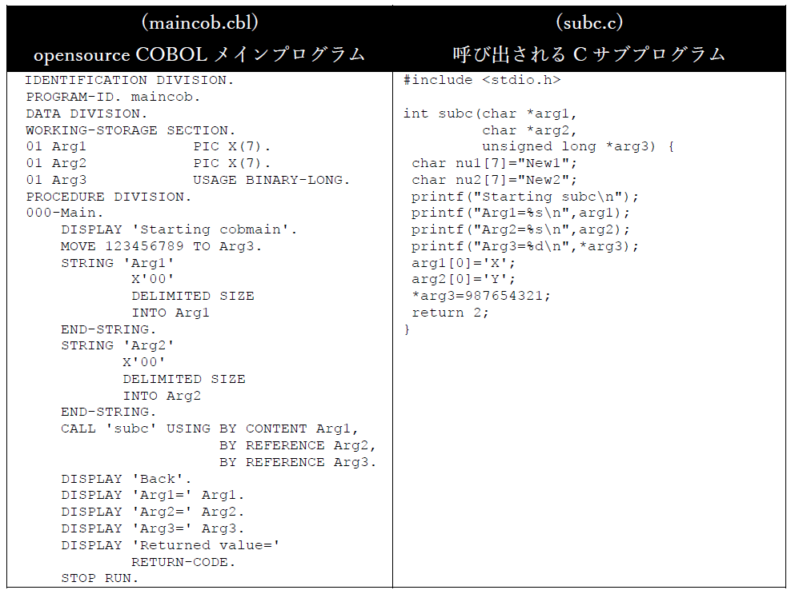

### 8.1.6 COBOLとCブログラムの結合

opensource COBOLとC言語プログラム間のリンクは可能だが、プログラム間でデータを受け渡すためには、いずれかのプログラムで少し特別なコーディングが必要になる場合があり、次の3つが主な対処法である。問題について説明し、具体的にどのように対処するか、実際のプログラムコードを示す。

#### 8.1.6.1 opensource COBOLランタイムライブラリの要件

COBOL言語の他の実装と同様に、opensource COBOLはランタイムライブラリを使用する。特定の実行シーケンスで実行される最初のプログラム単位がopensource COBOLプログラムである場合、ランタイムライブラリの初期化は、C言語プログラマにとって明確な方法であるCOBOLのコードによって実行される。ただし、Cプログラム単位が最初に実行される場合は、opensource COBOLランタイムライブラリの初期化を実行する負担がCプログラムにかかる。

#### 8.1.6.2 opensource COBOLとCの文字列割り当ての違い

どちらの言語も、文字列を固定長の連続した文字順序として格納する。

COBOLは、これらの文字順序を、データ項目のPICTURE句によって課される特定の数量制限まで格納する。例：

            01 LastName   PIC X(15).

USAGE DISPLAYデータ項目に含まれる文字列の長さは正確でなくてもよいが、PICTURE句で許可されている文字数は常に正確である必要がある。上記の例では、「LastName」には常に正確に15文字が含まれる。もちろん、現在のLastName値の一部として、0から15までの末尾の空白が存在する可能性がある。

実際、Cには「文字列」データ型がなく、配列の各要素が1文字である「char」データ型項目の配列として文字列を格納する。配列であるため、特定の「文字列」に格納できる文字数には上限がある。例：

            char lastName[15]; /* 15 chars: lastName[0] thru lastName[14] */

Cは、あるchar配列から別のchar配列に文字列をコピーしたり、特定の文字を文字列内で検索したり、あるchar配列を別のchar配列と比較したり、char配列を連結したりするための、強力な文字列操作関数を提供する。これらの機能を可能にするために、文字列の論理的な終了を定義できる必要があった。Cは、すべての文字列(char配列)がNULL文字(x'00')で終了することを期待してこれを実現する。もちろん、プログラマはこれを強制されてはいないが、文字列を操作するためにC標準関数を使用するのであれば、実行したほうが<u>よい</u>だろう。

#### 8.1.6.3 Cデータ型とopensource COBOL USAGE句の一致

これは非常に単純である。opensource COBOLとCのプログラマは、対応するCデータ型とCOBOLのUSAGE句を認識している必要がある。

表8-1-Cまたはopensource COBOLのデータ型の一致

| COBOLのUSAGE句 (PICTURE句は使用できない) | 占領する領域  | 保持できる数値 | 対応するデータ型 |
| :--- | :--- | :--- | :--- |
|BIARY-CHAR  BINARY-CHAR UNSIGNED  |   1バイト  | 0~255 |  unsigned char  |
| BINARY-CHAR SIGNED |  1バイト  | -128~+127 |  signed char  |
|  BINARY-SHORT   BINARY-SHORT  UNSIGNED |  2バイト  | 0~65535| unsigned   unsigned int   unsigned short   unsigned short int  |
| BINARY-SHORT SIGNED |  2バイト   | -32768~+32767| int   short   short int   signed int   signed short   signed short int|
| BINARY-LONG   BINARY-LONG  UNSIGNED |  4バイト  | 0~4294967295| unsigned long   unsigned long int |
| BINARY-LONG SIGNED | 4バイト |  -2147483648 ~ +2147483647| long   long int   signed long   signed long int |
| BINARY-C-LONG SIGNED |  4バイトまたは8バイト | -2147483648 ~ +2147483647または-9223372036854775808 ~ +9223372036854775807| long(USAGE BINARY-C-LONGの表5-10を参照)  |
| BINARY-DOUBLE   BINARY-DOUBLE UNSIGNED |  8バイト | 0~18446744073709551615|unsigned long long   unsigned long long int |
|BINARY-DOUBLE SIGNED|  8バイト | -9223372036854775808 ~ +9223372036854775807|long long int   signed long long int |
|COMPUTATIONAL-1| 4バイト |-3.4×1038　~+3.4×1038(小数点以下6桁の精度)  | float |
|COMPUTATIONAL-2| 8バイト | -1.7×10308　~+1.7×10308 (小数点以下15桁の精度)  |  double |
| N/A(opensource COBOLに相当するものなし) | 12バイト  | -1.19×10^4932　~+1.19×10^4932(小数点以下18桁の精度)  | long double |

同じストレージサイズと値の範囲の組み合わせを定義できる、他のopensource COBOLのPICTURE句またはUSAGE句の組み合わせがある。しかし(COMP-1とCOMP-2を除いて)、これらはCプログラムのデータ互換性のためのANSI2002標準仕様であり、データがCプログラムと共有されている場合、opensource COBOLプログラマはこれを使用することに慣れておく必要がある(優れたドキュメントでもあり、データがCプログラムと「共有」されるという事実を強調している)。

様々なSIGNED整数のUSAGE句で示されている最小値は、負の符号付きバイナリ値に2の補数表現を使用するコンピュータシステム(Windows PCでよく見られるCPUなど)に適している。負の符号付きバイナリ値に1の補数表現を使用するコンピュータシステムでは、最小値が1大きくなる(例えば、-128ではなく-127)。

#### 8.1.6.4 opensource COBOLメインプログラムのCサブプログラム呼び出し

CサブプログラムをCALLするopensource COBOLプログラムの例を次に示す。

図8-2-opensource COBOLのC呼び出し

考え方としては、2つの文字列と1つのフルワードの符号なし引数をサブプログラムに渡し、サブプログラムにそれらを出力させ、3つすべてを変更して、リターンコード2を呼び出し元に渡すことである。次に、呼び出し元は3つの引数を再表示し(2つのBY REFERENCE引数の変更<u>のみ</u>表示する)、リターンコードを表示して停止する。これら2つのプログラムは単純だが、必要な手法がよく説明されている。

COBOLプログラムが、nullの文字列終了符が両方の文字列引数に存在することの確認方法に注意すること。

Cプログラムは3つの引数に変更を加えようとしているため、関数の先頭で3つをポインターとして宣言し、関数の本体で3番目の引数をポインターとして参照する。`30`

これらのプログラムは、次のようにコンパイルおよび実行される。以下の例では、ネイティブCコンパイラを使用するopensource COBOLビルドを備えたUNIXシステムを想定している。この手法は、使用しているCコンパイラやオペレーティングシステムに関係なく、同じように機能する。

    $ cc –c subc.c
    $ cobc -x maincob.cbl subc.o
    $ maincob
    Starting cobmain
    Starting subc
    Arg1=Arg1
    Arg2=Arg2
    Arg3=123456789
    Back
    Arg1=Arg1
    Arg2=Yrg2
    Arg3=+0987654321
    Returned value=+000000002
    $

null文字は、実際はopensource COBOLの「Arg1」および「Arg2」データ項目にあるということに注意すること。出力には表示されないが存在する。文字列をCプログラムに渡す場合、文字列項目のnull終了<u>コピー</u>を作成してCプログラムに渡すことを推奨する。

6.7で説明したように、サブプログラムがopensource COBOL以外の言語で記述されている場合、opensource COBOLのサブプログラム呼び出しでは、BY CONTENT句を指定して、サブプログラムが引数を変更できないようにする必要がある。CALLする側のプログラムとCALLされる側のプログラムの<u>両方</u>がopensource COBOLである場合、BY VALUE句はBY CONTENT句のより高速な代替手段になる。

#### 8.1.6.5 Cメインプログラムのopensource COBOLサブプログラム呼び出し

ここでは前の章の2つの言語の役割が反転し、Cメインプログラムがopensource COBOLサブプログラムを実行する。

図8-3-Cのopensource COBOL呼び出し

Cプログラムはopensource COBOLサブルーチンの前に最初に実行されるため、opensource COBOLランタイム環境を初期化する負担はそのCプログラムにあり、「libcob」ライブラリの一部である「cob_init」関数を呼び出す必要がある。

「cob_init」ルーチンへの引数は、プログラムの実行開始時にメイン関数に渡された引数の数と値のパラメータである。これらをopensource COBOLサブプログラムに渡すことにより、そのopensource COBOLプログラムが、コマンドラインまたは個々のコマンドライン引数を取得できるようになる。それが必要なければ、「cob_init(0,NULL);」を代わりに指定できる。

Cプログラムは、「arg3」がサブプログラムによって変更されることを許可しているため、「&」を前に付けてBY REFERENCE句による引数呼び出しを強制する。「arg1」と「arg2」は文字列(char配列)であるため、自動的に参照渡しされる。

コンパイルプロセスとプログラム実行の出力を次に示す。以下の例では、GNU Cコンパイラを使用するopensource COBOLビルドを備えたWindowsシステムを想定している。この手法は、使用しているCコンパイラやオペレーティングシステムに関係なく、同じように機能する。

    C:\Users\Gary\Documents\Programs> cobc -S subcob.cbl
    C:\Users\Gary\Documents\Programs> gcc mainc.c subcob.s –o mainc.exe -llibcob
    C:\Users\Gary\Documents\Programs> mainc.exe
    Starting mainc...
    Starting cobsub.cbl
    Arg1=Arg1
    Arg2=Arg2
    Arg3=+0123456789
    Back
    Arg1=Xrg1
    Arg2=Xrg2
    Arg3=987654321
    Returned value=2
    C:\Users\Gary\Documents\Programs>

第1引数がBY VALUE句であることをopensource COBOLで記述したにも関わらず、BY REFERENCE句であるかのように扱われたことに注意すること。C呼び出し元からopensource COBOLサブプログラムに渡される文字列(char配列)引数は、サブプログラムによって変更可能である。サブプログラムによって変更されないようにする場合は、データの<u>コピー</u>を渡すのが最善である。

ただし、3番目の引数は異なる。これは配列ではないため、BY REFERENCE句`31`またはBY VALUE句`32`のいずれかで渡すことができる。

---
`30`: 実際には、2つの文字列(char配列)引数は選択できなかった。ポインターを表す「*」を先頭に付けずに関数コードで参照していても、関数内でポインターとして定義する<u>必要がある。</u>

`31`:  C呼び出しプログラムでは、引数に「&」を使用する。COBOLサブプログラムで引数をBY REFERENCE句として指定する。

`32`: C呼び出しプログラムでは、引数に「&」を使用してはいけない。COBOLサブプログラムで引数をBY VALUE句として指定する。